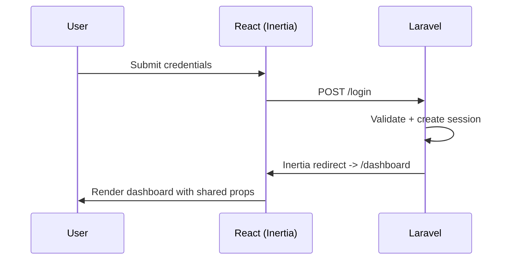
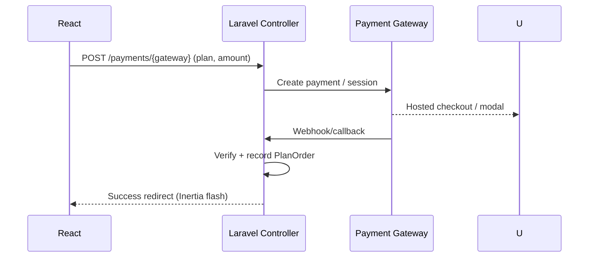

# System Flow

## Stack Overview

- Backend: Laravel 12 (MVC, queues, events, mail)
- Frontend: Inertia + React 19 + Vite + Tailwind
- Auth: Laravel session auth + email verification
- RBAC: Spatie Permissions (roles/permissions)
- Media: Spatie Media Library with dynamic storage (S3/Wasabi/local)
- Payments: Multiple gateways (Stripe, PayPal, Paystack, Razorpay, etc.)
- i18n: Inertia-shared locale + JSON resources

Key references:
- Routes (public + protected): [web.php](file:///Users/responsearchitects/Documents/Arems/facapp/fac/routes/web.php), [auth.php](file:///Users/responsearchitects/Documents/Arems/facapp/fac/routes/auth.php), [settings.php](file:///Users/responsearchitects/Documents/Arems/facapp/fac/routes/settings.php)
- Inertia shared props: [HandleInertiaRequests](file:///Users/responsearchitects/Documents/Arems/facapp/fac/app/Http/Middleware/HandleInertiaRequests.php)
- Dynamic storage: [DynamicStorageService](file:///Users/responsearchitects/Documents/Arems/facapp/fac/app/Services/DynamicStorageService.php)
- Plan orders: [PlanOrderController](file:///Users/responsearchitects/Documents/Arems/facapp/fac/app/Http/Controllers/PlanOrderController.php)
- React pages: [resources/js/pages](file:///Users/responsearchitects/Documents/Arems/facapp/fac/resources/js/pages)

## Request Lifecycle

1. HTTP request hits Laravel entrypoint [public/index.php](file:///Users/responsearchitects/Documents/Arems/facapp/fac/public/index.php)
2. Route resolved (see route files above)
3. Middleware pipeline applies:
   - Installation and landing checks
   - CSRF and session
   - Inertia shared props (global settings, auth, locale)
   - SaaS/plan gating and permission checks
4. Controller action executes domain logic
5. Response:
   - Inertia response for SPA pages
   - JSON/file for API/media

Mermaid overview:

```mermaid
flowchart LR
  A[Request] --> B[Route Match]
  B --> C[Middleware: Auth/Plan/Permission]
  C --> D[Controller]
  D --> E[Service/Model]
  E --> F[Response (Inertia/JSON/File)]
```

## Authentication Flow

- Guest routes: register/login/reset in [auth.php](file:///Users/responsearchitects/Documents/Arems/facapp/fac/routes/auth.php)
- Registration guarded by SaaS checks
- Email verification routes for signed links
- Post-login, user/roles/permissions injected via Inertia shared props
- Frontend auth pages: [resources/js/pages/auth](file:///Users/responsearchitects/Documents/Arems/facapp/fac/resources/js/pages/auth)

Sequence:



## Authorization & SaaS Controls

- Role/permission gates applied via middleware and query scopes
- Module-level access uses Spatie permissions
- Plan gating:
  - Public/payment routes behind minimal checks
  - All app modules behind `plan.access` middleware
- Permission-aware query filtering:
  - See [AutoApplyPermissionCheck](file:///Users/responsearchitects/Documents/Arems/facapp/fac/app/Traits/AutoApplyPermissionCheck.php)

## Frontend Flow

- SPA via Inertia; base view `app` rendered with shared props
- Global props include:
  - Auth user, roles, permissions
  - Global settings (currency, language, base URLs)
  - Company slug for multi-tenant-sensitive pages
- Layouts:
  - App layouts: [resources/js/layouts](file:///Users/responsearchitects/Documents/Arems/facapp/fac/resources/js/layouts)
  - Pages rendered from [resources/js/pages](file:///Users/responsearchitects/Documents/Arems/facapp/fac/resources/js/pages)
- Navigation and permissions enforced client-side using shared props plus server-side checks

## Payments Flow (Plans/Subscriptions)

High-level pattern (varies per gateway):



- Public callbacks defined in [web.php](file:///Users/responsearchitects/Documents/Arems/facapp/fac/routes/web.php#L88-L138)
- Authenticated payment initiations under `auth` + `checksaas` group [web.php](file:///Users/responsearchitects/Documents/Arems/facapp/fac/routes/web.php#L166-L260)
- React payment forms/components: [resources/js/components/payment](file:///Users/responsearchitects/Documents/Arems/facapp/fac/resources/js/components/payment)

## Media & Storage Flow

- Uploads and media management via Spatie Media Library
- Dynamic storage selection (local/S3/Wasabi) at runtime:
  - Config computed by [StorageConfigService] and applied by [DynamicStorageService](file:///Users/responsearchitects/Documents/Arems/facapp/fac/app/Services/DynamicStorageService.php)
- Media routes/controllers:
  - Protected media API in [web.php](file:///Users/responsearchitects/Documents/Arems/facapp/fac/routes/web.php#L271-L277)
- React media UI:
  - [media-library page](file:///Users/responsearchitects/Documents/Arems/facapp/fac/resources/js/pages/media-library.tsx)
  - [Media components](file:///Users/responsearchitects/Documents/Arems/facapp/fac/resources/js/components/MediaLibraryModal.tsx)

## HRM Modules Overview

- HR core: branches, departments, designations, employees, documents, holidays, shifts
- Performance: goals, indicators, reviews, cycles
- Payroll: salary components, payroll runs, payslips
- Recruitment: jobs, candidates, interviews, offers, onboarding
- Training: programs, sessions, assessments
- Meetings: rooms, meetings, minutes, attendees, action items
- Settings: system, email, currency, working days, webhooks, storage, brand, SEO
- Plans & billing: plans, orders, requests, coupons

Code entry points:
- Backend controllers: [app/Http/Controllers](file:///Users/responsearchitects/Documents/Arems/facapp/fac/app/Http/Controllers)
- Frontend pages: [resources/js/pages/hr](file:///Users/responsearchitects/Documents/Arems/facapp/fac/resources/js/pages/hr)

## Career Site Flow

- Public career pages with optional company slug:
  - Prefix `{userSlug?}/career` in [web.php](file:///Users/responsearchitects/Documents/Arems/facapp/fac/routes/web.php#L151-L158)
- Pages: [resources/js/pages/career](file:///Users/responsearchitects/Documents/Arems/facapp/fac/resources/js/pages/career)
- Apply flow:
  - Open job -> prefilled application form -> submit -> backend persists candidate and related data

## Inertia Shared Props (Global State)

- Implemented in [HandleInertiaRequests](file:///Users/responsearchitects/Documents/Arems/facapp/fac/app/Http/Middleware/HandleInertiaRequests.php)
- Provides:
  - Auth info (user, roles, permissions)
  - Global settings (currency/language, demo flags, base URLs)
  - Company slug for tenant-aware navigation
  - Flash messages for UI notifications

## Extending the System

- Add a new module:
  - Create Eloquent model + migration
  - Define controller actions and routes (group with permission middleware)
  - Add React pages under `resources/js/pages/<module>`
  - Update permissions and role seeds if needed
  - Follow plan/permission gating patterns

## Developer Utilities

- Local dev: `composer run dev` (spawns PHP server, queue listener, logs, and Vite)
  - Script in [composer.json](file:///Users/responsearchitects/Documents/Arems/facapp/fac/composer.json#L80-L88)
- Lint/format/types (frontend):
  - `npm run lint`, `npm run format`, `npm run types` in [package.json](file:///Users/responsearchitects/Documents/Arems/facapp/fac/package.json#L4-L12)

